# Retail Sales Data Warehouse

An end-to-end data warehouse built with SQL Server using **Medallion Architecture** (Bronze → Silver → Gold), covering ETL pipelines, data quality validation, dimensional modeling, and KPI analytics.

Built as part of my data engineering portfolio to demonstrate skills in SQL, ETL design, data quality, and analytical reporting.

---

## Architecture



The warehouse follows a three-layer medallion design:

| Layer | Purpose |
|---|---|
| **Bronze** | Raw ingestion from ERP & CRM CSV sources — no transformations |
| **Silver** | Cleansed, standardized, and deduplicated data |
| **Gold** | Star schema (fact + dimension views) ready for BI tools |

---

## Data Sources

Two source systems feed the warehouse:

- **CRM** (`source_crm/`) — customer info, product catalog, sales transactions
- **ERP** (`source_erp/`) — customer demographics, locations, product categories

---

## Project Structure

```
scripts/
  bronze/
    ddl_bronze.sql          — Create Bronze tables
    proc_load_bronze.sql    — BULK INSERT stored procedure (T-SQL)
    load_bronze.py          — Python ingestion alternative (pandas + pyodbc)
  silver/
    ddl_silver.sql          — Create Silver tables
    proc_load_silver.sql    — ETL transformations Bronze → Silver
  gold/
    ddl_gold.sql            — Create Gold views (star schema)
    rfm_segmentation.sql    — RFM customer segmentation analysis
    revenue_trends.sql      — Month-over-month revenue & 3-month rolling avg
    kpi_summary.sql         — Single-row KPI dashboard query
    product_performance.sql — Top 10 / Bottom 10 products by revenue
tests/
  quality_checks_silver.sql — Silver layer validation checks
  quality_checks_gold.sql   — Gold layer integrity checks
  data_quality_report.sql   — Comprehensive automated quality report
docs/
  data_architecture.png
  data_catalog.md
  data_quality_findings.md  — Documented findings from quality checks
datasets/
  source_crm/               — CRM CSV files
  source_erp/               — ERP CSV files
```

---

## Original Contributions (Beyond Base Project)

| File | What it adds |
|---|---|
| `scripts/bronze/load_bronze.py` | Python ingestion with pre-load validation (nulls, duplicates, row counts) as an alternative to BULK INSERT |
| `scripts/gold/rfm_segmentation.sql` | RFM scoring that segments customers into Champions, Loyal, At Risk, Lost |
| `scripts/gold/revenue_trends.sql` | MoM growth % and 3-month rolling average revenue |
| `scripts/gold/kpi_summary.sql` | Single-query KPI row: total revenue, AOV, top product, best month |
| `scripts/gold/product_performance.sql` | Top 10 / Bottom 10 products with margin estimate and % of total sales |
| `tests/data_quality_report.sql` | Automated quality report across all three layers |
| `docs/data_quality_findings.md` | Documented findings and transformation decisions |

---

## Tech Stack

- **SQL Server** / T-SQL — DDL, stored procedures, views
- **Python** — pandas, pyodbc (bronze ingestion script)
- **Draw.io** — architecture diagrams

---

## How to Run

### Prerequisites
- SQL Server (Express or Developer edition)
- SSMS or Azure Data Studio
- Python 3.8+ with `pandas` and `pyodbc` (for the Python loader only)

### Steps

```sql
-- 1. Create the database and schemas
-- Run: scripts/init_database.sql

-- 2. Create Bronze tables
-- Run: scripts/bronze/ddl_bronze.sql

-- 3. Load Bronze (choose one)
--   T-SQL:   EXEC bronze.load_bronze;
--   Python:  python scripts/bronze/load_bronze.py

-- 4. Create Silver tables
-- Run: scripts/silver/ddl_silver.sql

-- 5. Load Silver
EXEC silver.load_silver;

-- 6. Create Gold views
-- Run: scripts/gold/ddl_gold.sql

-- 7. Validate data quality
-- Run: tests/data_quality_report.sql
```

